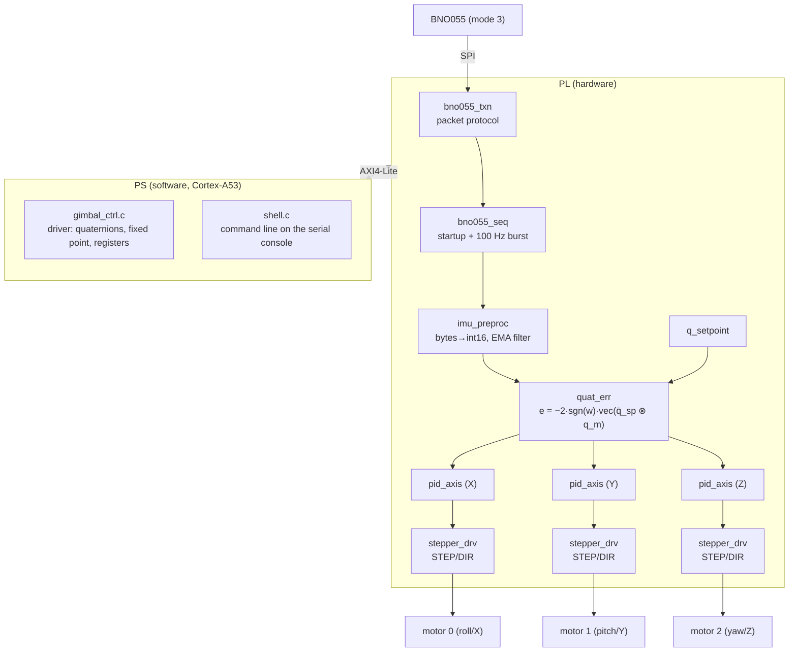

# IMU Gimbal — HW/SW Codesign on Zynq UltraScale+

A three-axis attitude control system for a BNO055 IMU and three stepper motors.
The entire control loop — sensor protocol, preprocessing, error computation,
PID and step generation — runs in the PL. The CPU parameterizes and observes
it, but never sits inside the loop.



## Features

- **Full BNO055 SPI stack in RTL** — packet protocol (`0xAA` / `0xBB` / `0xEE`),
  polling for the deferred response, timeouts, startup sequence into NDOF
  fusion mode, and automatic re-initialization after repeated bus errors.
- **Quaternion-based control** — no Euler angles anywhere in the control path,
  so the controller has no singularities and always takes the shorter rotation.
- **Fixed-point PID per axis** with conditional-integration anti-windup and
  derivative on the measured rate.
- **Stepper output with slew rate limiting** — a 32-bit DDS drives STEP/DIR,
  ramped per control tick so commanded jumps cannot cause step loss.
- **AXI4-Lite control interface** — setpoint, gains, limits, telemetry and a
  new-sample interrupt.
- **Self-checking testbench** with a behavioral BNO055 model, plus a host-side
  driver test that needs no FPGA.

## Repository layout

```
hw/rtl/     spi_master.sv       SPI mode 3, byte oriented
            bno055_txn.sv       BNO055 packet protocol (request/poll/response)
            bno055_seq.sv       reset, startup sequence, cyclic burst read
            imu_preproc.sv      byte assembly and EMA filtering
            quat_err.sv         quaternion error (16 multipliers, 2 stages)
            pid_axis.sv         fixed-point PID with anti-windup
            stepper_drv.sv      DDS, slew rate limiter, STEP/DIR/EN
            imu_gimbal_axi.sv   AXI4-Lite slave and top level
hw/sim/     bno055_spi_model.sv behavioral sensor model
            tb_imu_gimbal.sv    self-checking testbench
hw/xdc/     kria_k26_gimbal.xdc, zcu104_gimbal.xdc
hw/scripts/ build_hw.tcl, run_sim.ps1
sw/include/ gimbal_regs.h       register map, single source of truth
sw/drivers/ gimbal_ctrl.{h,c}   driver
sw/app/     main.c, shell.{h,c} application and command line
sw/test/    test_driver.c       host test, no hardware required
sw/scripts/ build_sw.py         Vitis Unified build script
```

## Supported targets

| Target | Part | Board part | Constraints |
|---|---|---|---|
| Kria K26 SOM (default) | `xck26-sfvc784-2LV-c` | `xilinx.com:kr260_som:part0:2.0` | `hw/xdc/kria_k26_gimbal.xdc` |
| ZCU104 | `xczu7ev-ffvc1156-2-e` | `xilinx.com:zcu104:part0:1.1` | `hw/xdc/zcu104_gimbal.xdc` |

Select the target with the second script argument:

```bash
vivado -mode batch -source hw/scripts/build_hw.tcl -tclargs all zcu104
```

Only the part, board part and constraint file change; the RTL is identical.
The build aborts with a clear message if the selected device family is not
installed in the local Vivado.

Built and verified with **Vivado / Vitis 2026.1**.

## Getting started

### 1. RTL simulation

```bash
powershell -ExecutionPolicy Bypass -File hw\scripts\run_sim.ps1
```

Runs `xvlog`/`xelab`/`xsim` directly — no Vivado project needed. Exit code 0
means every check passed. Add `-Wave` to record a waveform database and print
the command to open it.

The same testbench is registered as `sim_1` in the generated Vivado project,
so *Run Behavioral Simulation* in the GUI works as well.

### 2. Hardware

```bash
vivado -mode batch -source hw\scripts\build_hw.tcl
```

Creates the project and block design (Zynq MPSoC, SmartConnect and the custom
IP as a module reference), implements, and writes `build/gimbal.xsa`. Use
`-tclargs bd` or `-tclargs synth` to stop earlier.

### 3. Software

```bash
vitis -s sw\scripts\build_sw.py
```

In the Vitis GUI instead: *Create Platform Component* from `build/gimbal.xsa`
(standalone, `psu_cortexa53_0`), then *Create Application Component* with the
`empty_application` template, and import the six files from `sw/include`,
`sw/drivers` and `sw/app` into `src/`.

### 4. Host test of the driver

```bash
gcc -std=c99 -I sw/include -I sw/drivers -I sw/app sw/drivers/gimbal_ctrl.c sw/app/shell.c sw/test/test_driver.c -lm -o test_driver
```

The test points the register base address at a plain array and checks
quaternion algebra, fixed-point conversion, control bits and the command
parser.

## Register map (AXI4-Lite, 4 KiB)

| Offset | Name | Access | Description |
|--------|------|--------|-------------|
| `0x000` | `ID` | RO | `0x424E4F35` (`"BNO5"`) |
| `0x004` | `VERSION` | RO | `0x00010000` |
| `0x008` | `CLK_HZ` | RO | PL clock, lets software derive all timings |
| `0x00C` | `SCRATCH` | RW | unused, useful as a bus self-test |
| `0x010` | `CTRL` | RW | see below |
| `0x014` | `STATUS` | RO | see below |
| `0x018` | `SAMPLE_CNT` | RO | valid samples |
| `0x01C` | `ERR_CNT` | RO | SPI protocol errors |
| `0x020` | `IRQ_STATUS` | RW1C | bit 0 = new sample |
| `0x030`…`0x03C` | `SP_Q{W,X,Y,Z}` | RW | setpoint quaternion, Q1.14 |
| `0x040`…`0x04C` | `MEAS_Q{W,X,Y,Z}` | RO | measured quaternion, Q1.14 |
| `0x050`…`0x058` | `ERR_{X,Y,Z}` | RO | attitude error, Q1.14 (≈ radians) |
| `0x05C` | `ERR_QW` | RO | scalar part of `q_err` |
| `0x060`…`0x068` | `EUL_{YAW,ROLL,PITCH}` | RO | 1/16 degree |
| `0x06C`…`0x074` | `GYR_{X,Y,Z}` | RO | 1/16 dps |
| `0x080` + `0x10·n` | `KP/KI/KD/ILIM[n]` | RW | Q16.16 gains, increment limit |
| `0x0B0` | `OUT_LIM` | RW | maximum phase increment |
| `0x0B4` | `ACC_LIM` | RW | maximum change per control tick |
| `0x0B8` | `STEP_WIDTH` | RW | STEP pulse width in PL clocks |
| `0x0BC` | `MS_CFG` | RW | `[2:0]` MS1–3, `[3]` nRESET, `[4]` nSLEEP |
| `0x0C0`…`0x0C8` | `MOT_POS[n]` | RO | signed step counters |
| `0x0CC`…`0x0D4` | `MOT_VEL[n]` | RO | current increment |
| `0x0E0` | `SAMPLE_DIV` | RW | control period in PL clocks |
| `0x0E4` | `SPI_DIV` | RW | `f_sclk = f_clk / (2·(div+1))`, `div ≥ 2` |
| `0x0E8` | `INIT_DLY` | RW | power-on reset delay; scales all startup delays |
| `0x0EC` | `POLL_MAX` | RW | maximum dummy bytes awaiting a response |
| `0x0F0` | `FILT_CFG` | RW | `[3:0]` gyro EMA k, `[7:4]` quaternion EMA k |
| `0x0F4` | `LED_CFG` | RW | `[3:0]` pattern, `[4]` override enable |
| `0x100`…`0x10C` | `HOME_Q{W,X,Y,Z}` | RO | attitude captured at startup |

**`CTRL`** — `[0]` IMU_EN · `[1]` CTRL_EN · `[2]` MOT_EN · `[3]` CAPTURE (pulse)
· `[4]` ICLEAR (pulse) · `[5]` D_FROM_GYRO · `[6]` IRQ_EN · `[7]` ZERO_POS
(pulse) · `[10:8]` DIR_INVERT, one bit per motor

**`STATUS`** — `[0]` IMU_OK · `[1]` INIT_DONE · `[2]` BUS_ERR · `[3]` level on
the BNO055 INT pin · `[15:8]` last error code (`0xF0` timeout, `0xF1` wrong
CHIP_ID) · `[23:16]` BNO055 `CALIB_STAT` · `[31:24]` state machine, debug only

## Hardware preprocessing pipeline

1. **Packet protocol.** `bno055_txn` speaks the BNO055 protocol
   (`0xAA <rw> <reg> <len>` answered with `0xBB <len> <data>` or
   `0xEE <status>`), including the poll loop that SPI requires because the
   sensor does not return its answer immediately. Timeouts and error codes are
   exposed in `STATUS`.
2. **Startup sequence.** Hardware reset, power-on delay, CHIP_ID verification,
   `PAGE_ID=0`, `OPR_MODE=CONFIG`, `SYS_TRIGGER`, `PWR_MODE`, `UNIT_SEL`,
   `OPR_MODE=NDOF`. After eight consecutive bus errors the state machine
   re-initializes the sensor on its own.
3. **One burst instead of ten transfers.** Gyro, Euler angles and quaternion
   occupy a contiguous block at `0x14`…`0x27`, so one 20-byte read per control
   tick collects everything.
4. **Formatting.** LSB-first byte pairs are assembled into signed 16-bit values.
5. **Filtering.** A multiplier-free EMA, `y += (x − y) >> k`, configurable
   separately for gyro and quaternion. Euler angles are deliberately left
   unfiltered because heading wraps from 360° to 0° and an EMA would produce
   garbage across that discontinuity.
6. **Attitude error.** `q_err = q̄_sp ⊗ q_meas`, then
   `e = −2·sgn(w_err)·vec(q_err)` — the rotation vector in body coordinates
   still required to reach the setpoint. For small angles `e ≈ θ·axis` in
   radians. The `sgn(w)` factor always selects the shorter of the two
   equivalent rotation paths, since `q` and `−q` describe the same attitude;
   without it the controller would turn the wrong way for errors beyond 180°.

## Control law

One fixed-point PID per axis:

```
u = Kp·e + Ki·∫e + Kd·d          d = −ω_gyro  (default)  or  e[n] − e[n−1]
```

- **Derivative on measurement.** The default derivative source is the gyro rate
  rather than `de/dt`, so a setpoint step produces no derivative kick, and the
  gyro is the lower-noise signal anyway.
- **Anti-windup.** The integrator is frozen while the output saturates in the
  direction the error would keep pushing it.
- **The output is a rate.** `u` is the phase increment of a 32-bit DDS,
  `f_step = f_clk · u / 2³²`. `ACC_LIM` bounds the change per control tick and
  `OUT_LIM` the magnitude.
- **Defaults** (`main.c`): `Kp = 150`, `Ki = 0`, `Kd = 8`, 4000 steps/s,
  40000 steps/s². Intentionally conservative — add `Ki` only once `Kp` and `Kd`
  are tuned.

## Command line

```
gimbal> help
  start / stop                 initialize the sensor / disable everything
  ctrl <0|1> / motors <0|1>    enable the controller / driver stages
  rpy <r> <p> <y>              setpoint in degrees, relative to home
  arpy <r> <p> <y>             setpoint in degrees, absolute
  quat <w> <x> <y> <z>         setpoint as a quaternion
  capture / home               adopt current attitude / return to home
  pid <x|y|z> <kp> <ki> <kd>   controller gains
  ilim <axis> <steps/s>        integrator limit
  limit <steps/s> <steps/s²>   rate and acceleration limits
  dgyro <0|1>                  derivative on gyro or on de/dt
  filt <gyro_k> <quat_k>       filter strength
  ms <0..7> / invert <mask>    microstepping / direction
  rate <hz> / spi <hz>         loop rate / SPI clock
  status / show / mon <n>      telemetry
  zero / clr                   reset step counters / integrators
  reg <offset> [value]         raw register access
```

The **startup attitude is the default setpoint**: the hardware latches the
first valid sample after `IMU_EN` into both `SP_Q*` and `HOME_Q*`. `rpy`
commands are applied relative to it (`q_sp = q_home ⊗ q_δ`) and `home` restores
it.

Example session:

```
gimbal> start
gimbal> ctrl 1
gimbal> motors 1
gimbal> rpy 0 15 0        # 15 degrees of pitch relative to the startup pose
gimbal> mon 30
gimbal> home
```

## Wiring

Pin assignments live in `hw/xdc/`. On the K26 all signals are on `SOM240_1`,
IO bank 66.

| Signal | Function |
|---|---|
| `imu_sclk/mosi/miso/csn` | BNO055 SPI, mode 3, 1 MHz by default |
| `imu_rstn` | BNO055 nRESET, driven by the startup state machine |
| `imu_int` | BNO055 INT, synchronized and readable in `STATUS[3]` |
| `mot_step/dir/en_n[2:0]` | A4988 / DRV8825, `en_n` active low |
| `drv_ms[2:0]`, `drv_rstn`, `drv_slpn` | microstepping and driver enable |
| `led[3:0]` | IMU_OK, INIT_DONE, CTRL_EN, heartbeat |

Two constraints that matter on real hardware:

- **Level shifting is mandatory.** Bank 66 on the K26 (and the FMC LA pins on
  the ZCU104) run at 1.8 V, while the BNO055 and the stepper drivers are 3.3 V
  parts.
- **The BNO055 must be strapped for SPI** through its `PS1`/`PS0` pins. If the
  breakout board does not expose that strapping, the sensor never answers and
  `STATUS.LASTERR` stays at `0xF0` (timeout) or `0xF1` (wrong CHIP_ID).

## Axis mapping

Direct-drive gimbal, one motor per axis: `ERR_X` → motor 0 (roll), `ERR_Y` →
motor 1 (pitch), `ERR_Z` → motor 2 (yaw). Individual directions can be
reversed through `CTRL[10:8]` (`invert <mask>`) without rewiring.

Three actuators are the minimum for three rotational degrees of freedom and
are sufficient for this topology. Two properties follow from the mechanics
rather than the control law:

- A cardanic suspension loses one degree of freedom near ±90° of the middle
  axis. The control path is singularity-free because it works in quaternions,
  but the mechanism is not; full SO(3) coverage requires a fourth, redundant
  axis.
- Steppers suit direct joint actuation. They are a poor fit for reaction-wheel
  attitude control, which needs high wheel speed and momentum storage.

A coupled mechanism (Stewart-style) would need a 3×3 mixing matrix between
`quat_err` and the PID blocks; register space from `0x110` upwards is reserved
for it.

## Implementation results

Kria K26, 100 MHz PL clock, Vivado 2026.1:

| Metric | Value |
|---|---|
| Worst negative slack | +4.04 ns |
| CLB LUTs | 5308 (4.5 %) |
| CLB registers | 3612 (1.5 %) |
| DSPs | 37 (3.0 %) |
| Block RAM | 0 |
| Bonded IOBs | 24 |
| IP base address | `0xA000_0000` |

## Verification status

- RTL simulation against the behavioral sensor model: all checks pass, covering
  AXI access, startup sequence, preprocessing, quaternion error, stepper output,
  setpoint changes, the interrupt and the SPI error path.
- Host test of the driver: all checks pass.
- Vivado implementation and Vitis build complete end to end.

The design has **not** been run on physical hardware. The simulation validates
the RTL against a model of the sensor protocol; where the BNO055 datasheet is
thin on SPI details — response latency and chip-select behaviour between
request and response — the model follows common practice, and those assumptions
can only be confirmed against a real device.

## License

MIT — see [LICENSE](LICENSE).
